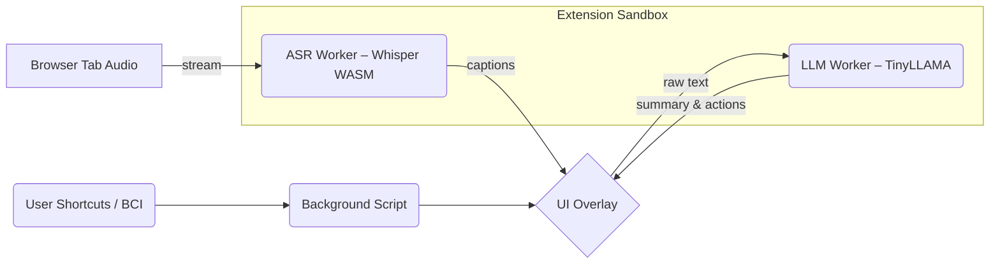
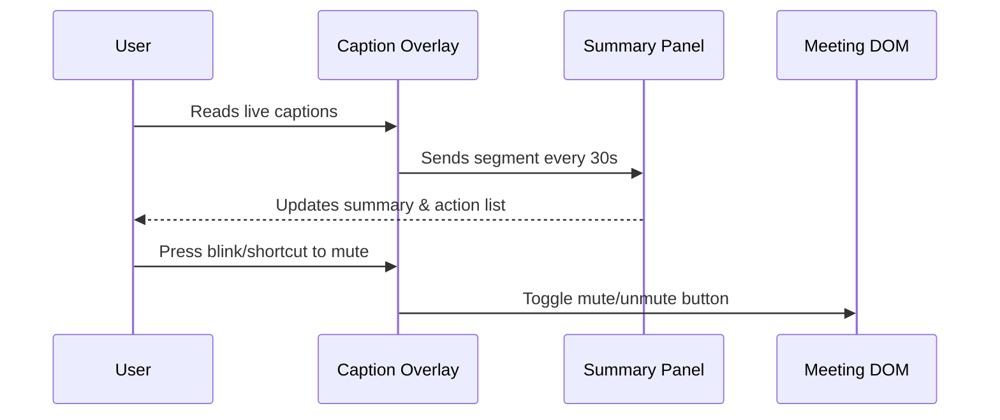

# Project Proposal – "LimitlessMeet" – An Inclusive Meeting Co-Pilot

## 1. Overview
LimitlessMeet is a browser-based co-pilot that transforms any video-conference tab (Zoom, Google Meet, Teams, Webex, etc.) into an accessible, productivity-boosting workspace. Running fully on the user’s machine, it provides:

* live, highly accurate captions (speech-to-text) with custom styling
* real-time summarisation and topic segmentation
* automatic extraction of action items, deadlines and decisions
* smart shortcuts (keyboard or accessibility-switch triggers) to mute/unmute, raise hand, or send quick reactions
* session log export to Markdown, HTML or accessible PDF

By fusing state-of-the-art on-device ASR (WhisperKit-micro) with lightweight LLM summarisation, LimitlessMeet empowers Deaf/HoH participants, neurodivergent individuals, people with motor impairments, and anyone who struggles with information overload—making remote work truly **Limitless**.

The extension is free, privacy-preserving (no cloud audio), and aligns with the NextStep Hacks tracks:
* **Limitless theme** – removes accessibility barriers in communication
* **Future of Work prize** – reimagines inclusive collaboration tools

---

## 2. Core Features
| Category | Feature | Impact |
|----------|---------|--------|
| Accessibility | On-device captions with adjustable size, colours, fonts | Deaf/HoH users read speech instantly without server latency |
|  | Caption timeline scroll-back & word search | Revisit missed phrases |
|  | Keyboard/BCI macro binding (e.g., blink→mute) | Motor-impaired users control meetings hands-free |
| Productivity | Live meeting summary panel updated every 30 s | Cognitive load reduction |
| | Action item & decision extraction with assignee detection | Clear follow-ups |
| | One-click export (Markdown/HTML/PDF) incl. speaker labels | Seamless documentation |
| Privacy | Entire pipeline runs in browser (WebAssembly) | No audio leaves device |
| Developer | WebExtension APIs + open REST port | Easy integration into other tools |

---

## 3. Tech Stack
* **Front-end:**
  * TypeScript + React (UI panels, settings)
  * TailwindCSS (low-vision friendly themes)
  * WebExtension APIs (Chrome, Edge, Firefox compatibility)
* **ASR Engine:**
  * Whisper.cpp compiled to WebAssembly with INT4 quantised *WhisperKit-micro* weights (~60 MB)
  * Audio capture via Chrome tabCapture API → AudioWorklet → ring buffer
* **LLM Summariser:**
  * TinyLLAMA-1.1B-chat quantised to GGML, executed in Web Worker (wasm-LLM)
  * Post-processing with rule-based NLP (action keyword patterns)
* **Shortcut / BCI Layer:**
  * WebHID API for USB switches / blink macro pad
  * Fallback keyboard shortcuts (configurable)
* **Packaging & Tooling:** pnpm, Vite, ESLint, Prettier, Playwright e2e tests

---

## 4. Project Structure
```
limitlessmeet/
├─ extension/
│  ├─ manifest.json
│  ├─ background/
│  │   └─ recorder.ts            # audio capture & ASR pipeline
│  ├─ content/
│  │   ├─ inject.tsx            # DOM injection, overlay captions
│  │   └─ shortcuts.ts          # mute/unmute hooks
│  ├─ ui/
│  │   ├─ App.tsx               # React root (captions + summary)
│  │   ├─ SummaryPanel.tsx
│  │   └─ SettingsModal.tsx
│  ├─ workers/
│  │   ├─ whisper.wasm          # Quantised model
│  │   └─ llm-worker.ts         # TinyLLAMA summariser
│  └─ assets/
│      └─ icons/
├─ docs/
│  ├─ diagrams/
│  │   ├─ architecture.mmd
│  │   └─ ui-flow.mmd
│  └─ README.md
├─ tests/
│  └─ e2e/
├─ package.json
└─ pnpm-lock.yaml
```

---

## 5. Diagrams

### 5.1 High-Level Architecture (Mermaid)


### 5.2 UI Flow


---

## 6. Future Directions
1. **Multilingual Auto-Detection** – switch caption language and provide side-by-side translation.
2. **ASL Gesture Overlay** – integrate webcam sign-language recognition to feed into captions for hearing colleagues.
3. **Emotion & Engagement Meter** – privacy-safe sentiment analysis to alert when audience appears confused.
4. **Cloud Optionality** – allow enterprise users to connect to faster GPU backend while keeping encryption end-to-end.
5. **Mobile Companion App** – sync captions/summaries to a phone or Dot Pad multiline braille display for DeafBlind users.

---

## 7. Conclusion
LimitlessMeet tackles the core barriers that people with disabilities face in modern remote work—access to speech, cognitive load, and control. By running everything locally and integrating seamlessly into existing meeting tools, it embodies the hackathon’s *Limitless* spirit and is deliverable in a weekend sprint.